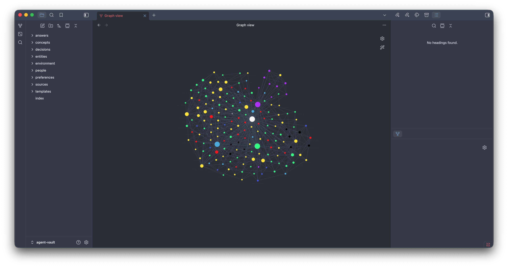

# obsidianwiki



*Obsidian graph view of the `agent-vault` knowledge base.*

Hermes memory provider backed by an **Obsidian wiki vault** - the LLM-wiki
pattern (Karpathy-style) as a first-class `MemoryProvider`.

The agent's long-term knowledge lives in a plain Obsidian vault the user can
read and edit in the Obsidian app at any time (iCloud-synced). The plugin
enforces wiki discipline automatically, so the agent cannot let the vault rot.

## What it enforces

| Rule | How |
|------|-----|
| Index-first | prefetch() scores pages against each turn; system prompt carries a live catalog |
| No drift | every `write` regenerates index.md stats/bullets and appends to log.db/log.md |
| Typed pages | folder decides type: entities/, concepts/, sources/, answers/ |
| Read-only sources | write_page rejects anything under sources/ |
| No orphans | lint reports pages with zero inbound wikilinks |
| Fresh claims | lint flags pages whose `updated` is older than their last log mention |

## Tool surface (obsidian_wiki)

- read - full page content (+ similar-page suggestions on miss)
- search - token-scored scan with snippets
- list - stats + catalog
- write - create/update page; frontmatter `type`/`updated` derived from
  folder and stamped automatically; index + log updated in the same call
- lint - orphans, broken links, missing frontmatter, stale claims
- log - recent operation tail

## Config (config.yaml)

```yaml
plugins:
  obsidian-wiki:
    vault_path: "/path/to/agent-vault"
    prefetch_limit: 3
    prefetch_min_query_chars: 10
    inject_index_on_start: true
```

Vault discovery precedence is explicit and portable: Hermes plugin `vault_path`, then `OBSIDIAN_VAULT_PATH`, then `~/Documents/agent-vault`. The standalone MCP server does not read Hermes config; pass the same path via `OBSIDIAN_VAULT_PATH` or `--vault-path`.

Activate with:

```bash
hermes config set memory.provider obsidianwiki
hermes memory status   # verify
```

Restart the session/gateway after switching providers.

## Configure MCP clients

The Obsidian Wiki MCP server is a standalone MCP server. The same server can be
used by Hermes, AGY, Codex, Claude Code, Claude Desktop, Cursor, and other MCP
clients. Configure the server once, then add a client entry using the transport
supported by that client.

For the Hermes `obsidianwiki` memory provider, **MCP is the default access mode**
for wiki reads and writes. The existing direct filesystem adapter remains
available only as an explicit offline fallback with `access_mode: direct`.

### Option A: Streamable HTTP — shared server (recommended)

Start one central server on localhost:

```bash
OBSIDIAN_VAULT_PATH="/absolute/path/to/agent-vault" \\
  .venv/bin/fastmcp run mcp_server.py:mcp \\
  --transport http --host 127.0.0.1 --port 8765
```

Configure clients that support Streamable HTTP with this endpoint:

```text
http://127.0.0.1:8765/mcp
```

**Hermes** — add to `~/.hermes/config.yaml`:

```yaml
mcp_servers:
  obsidian_wiki:
    url: "http://127.0.0.1:8765/mcp"
    timeout: 120
    connect_timeout: 10
```

**AGY** — register it with the AGY CLI:

```bash
agy mcp add obsidian_wiki http://127.0.0.1:8765/mcp
agy mcp list
```

**Codex / Claude Code / Claude Desktop / Cursor** — add an HTTP MCP server
entry using the configuration format and file location documented by the
client. A typical logical configuration is:

```json
{
  "mcpServers": {
    "obsidian_wiki": {
      "url": "http://127.0.0.1:8765/mcp"
    }
  }
}
```

### Option B: stdio — one client-owned server process

For clients that prefer stdio, configure the Python entry point directly. Use
absolute paths and pass the vault path explicitly:

```json
{
  "mcpServers": {
    "obsidian_wiki": {
      "command": "/absolute/path/to/obsidian-wiki/.venv/bin/python",
      "args": ["/absolute/path/to/obsidian-wiki/mcp_server.py"],
      "env": {
        "OBSIDIAN_VAULT_PATH": "/absolute/path/to/agent-vault"
      }
    }
  }
}
```

This JSON shape is commonly used by Codex, Claude Code, Claude Desktop, and
Cursor, but the exact config file location and supported transport vary by
client. For AGY, use its CLI instead:

```bash
agy mcp add obsidian_wiki \\
  /absolute/path/to/obsidian-wiki/.venv/bin/python \\
  /absolute/path/to/obsidian-wiki/mcp_server.py
agy mcp list
```

### Verify and use the connection

Restart the client after changing its MCP configuration. Ask it to list or use
`memory_search`, `memory_read`, `memory_list`, `memory_lint`, `memory_log`, and
`memory_write`.

Useful checks:

```bash
# AGY
agy mcp list

# Hermes
hermes mcp list

# Inspect the server implementation
.venv/bin/fastmcp inspect mcp_server.py:mcp
```

If a client cannot connect, verify that the server is running, the endpoint is
`127.0.0.1:8765`, the vault path is absolute and correct, and the client was
restarted after configuration changes. Keep the server bound to localhost
unless authentication and network exposure are deliberately configured.

## Scripts and session ingest

The `scripts/` directory contains both automatic Hermes integration and
optional manual utilities. Files in this directory do **not** run merely by
being present; they run only when Hermes, a cron job, or the operator invokes
them.

| Script | Purpose | Automatic? | Requires Hermes? |
|--------|---------|------------|------------------|
| `wiki_turn_hook.py` | Hermes `on_session_end` hook; captures the completed session and launches extraction in the background | Yes, when the hook is configured | Yes |
| `wiki_session_capture.py` | Exports user/assistant dialogue from Hermes `state.db` into `sources/sessions/` | No, unless called by the hook | Reads Hermes `state.db` by default |
| `wiki_session_extract.py` | Sends selected source transcripts to the auxiliary LLM and merges durable knowledge into curated pages | No, unless called by the hook | Uses Hermes auxiliary runtime by default |
| `wiki_backlog_extract.py` | Processes all pending session sources one at a time with resumable state | No | Uses Hermes runtime by default |
| `wiki_backlog_status.py` | Displays backlog progress, runner status, ETA, and curated page count | No | No, but reads local Hermes paths by default |
| `wiki_ingest.sh` | Convenience wrapper: capture sessions, then extract knowledge | No | Yes for its default capture/extract paths |

### Automatic flow through Hermes

When the `on_session_end` shell hook is configured, the flow is:

```text
Hermes reports a completed session
              |
              v
       wiki_turn_hook.py
              |
              +--> MCP memory_ingest_submit
                              |
                              v
                    central memory server
                              |
                              +--> capture
                              +--> extract/dedup
                              +--> write curated pages
                              |
                              v
                         agent-vault
```

`wiki_turn_hook.py` is invoked after a **completed session**, not after every
individual chat turn. It submits an idempotent ingest request to the local
Obsidian Memory MCP server; the server owns capture, extraction, deduplication,
locking, and vault writes. It skips cron sessions and exits successfully on
errors so memory ingestion cannot break the main agent response.

The hook is configured in Hermes `config.yaml` as an `on_session_end` command,
for example:

```yaml
hooks:
  on_session_end:
    - command: python3 /path/to/obsidianwiki/scripts/wiki_turn_hook.py
```

The hook is not enabled merely by installing this repository. It must be
registered in the Hermes configuration and the gateway/session process may
need a restart after configuration changes.

Disable the automatic hook temporarily with:

```bash
export WIKI_INGEST_DISABLE=1
```

For a persistent gateway setup, define the variable in the environment used by
the gateway. `WIKI_INGEST_DISABLE` prevents capture and extraction from the
hook, but does not disable scripts that the operator runs manually.

### Manual session pipeline

The manual pipeline is useful for reprocessing, debugging, or standalone
maintenance. Resolve the vault path explicitly when it is not the default:

```bash
export OBSIDIAN_VAULT_PATH="/absolute/path/to/agent-vault"
export HERMES_STATE_DB="$HOME/.hermes/state.db"
```

Capture one session:

```bash
python3 scripts/wiki_session_capture.py \
  --session <session-id> \
  --min-chars 300 \
  --force
```

Extract one captured source. The selector is relative to
`sources/sessions/`:

```bash
$HOME/.hermes/hermes-agent/venv/bin/python \
  scripts/wiki_session_extract.py \
  --sessions YYYY/MM/DD/<session-id>.md \
  --apply
```

Run the convenience wrapper:

```bash
bash scripts/wiki_ingest.sh
```

The wrapper captures uncaptured sessions and then extracts the newest pending
sources. It is not automatically scheduled by this repository.

### Backlog processing

For a large backlog, use the resumable extractor. It stores progress in
`$WIKI_BACKLOG_STATE`, defaulting to `$HOME/.hermes/cache/wiki-backlog-state.json`:

```bash
OBSIDIAN_VAULT_PATH="/absolute/path/to/agent-vault" \
  HERMES_PYTHON="$HOME/.hermes/hermes-agent/venv/bin/python" \
  python3 scripts/wiki_backlog_extract.py
```

Check progress:

```bash
OBSIDIAN_VAULT_PATH="/absolute/path/to/agent-vault" \
  python3 scripts/wiki_backlog_status.py
```

The backlog extractor skips cron sessions, processes one source at a time,
records `pending`, `success`, `skip`, or `fail`, and resumes from its state
file after interruption. The status script is informational only; it does
not start or stop the extractor.

### Logs and extraction status

- Detailed extraction audit: `WIKI_AUDIT_LOG`, default
  `$HOME/.hermes/logs/wiki-extract-audit.jsonl`
- Background hook logs: `$HOME/.hermes/logs/wiki-extract-<session-id>.log`
- Backlog state: `WIKI_BACKLOG_STATE`, default
  `$HOME/.hermes/cache/wiki-backlog-state.json`
- Source frontmatter: `extract_status: pending|success|skip|fail`

Do not commit these runtime files. The repository `.gitignore` excludes local
state, logs, caches, environment files, lock files, SQLite logs, and build
artifacts.

### What is and is not automatic

| Operation | Automatic by the Hermes plugin? | Manual command available? |
|-----------|----------------------------------|---------------------------|
| Capture a completed Hermes session | Yes, via the configured hook and MCP ingest server | Yes |
| Extract durable knowledge | Yes, via the MCP ingest worker after hook submission | Yes |
| Process an old backlog | No | Yes, `wiki_backlog_extract.py` or MCP ingest |
| Show backlog status | No | Yes, `wiki_backlog_status.py` or `memory_ingest_status` |
| Run the full wrapper | No | Yes, `wiki_ingest.sh` |
| MCP read/write memory | No passive capture; MCP exposes memory operations and ingest tools | Yes, through any MCP client |

The plugin integrates completed Hermes sessions only through the configured
hook. The hook is a thin MCP client and does not write the vault itself. The
standalone MCP server does not passively listen for Hermes conversations; it
processes sessions when the hook submits `memory_ingest_submit`, and provides
memory read/search/list/lint/log/write operations for Codex, Claude Code, AGY,
and other MCP clients.

### Central server mode for multiple Hermes profiles

When several Hermes profiles share one vault, run one long-lived MCP server
and configure every profile as an HTTP MCP client. Do not start one stdio
server per profile against the same vault.

```text
Hermes profile A ─┐
Hermes profile B ─┼── http://127.0.0.1:8765/mcp
Hermes profile C ─┘             │
                               ▼
                    one obsidian-memory server
                               │
                    central ingest job worker
                               │
                               ▼
                         agent-vault
```

Start the central server once:

```bash
OBSIDIAN_VAULT_PATH="/absolute/path/to/agent-vault" \
  .venv/bin/fastmcp run mcp_server.py:mcp \
  --transport http --host 127.0.0.1 --port 8765
```

Configure each Hermes profile with the same endpoint:

```yaml
mcp_servers:
  obsidian_wiki:
    url: "http://127.0.0.1:8765/mcp"
    timeout: 120
    connect_timeout: 10
```

The server exposes `memory_ingest_submit` and `memory_ingest_status` in
addition to the memory read/write tools. `memory_ingest_submit` accepts an
optional `request_id`; retrying the same request ID returns the original job
instead of creating a duplicate. The server serializes ingest jobs in one
worker and sends capture/extraction output through the server-owned vault
configuration. `wiki_turn_hook.py` is now a thin event client that submits a
completed-session job instead of writing the vault itself.

Job/request metadata is persisted in the server's local `WIKI_JOB_DB`
(default: `$HOME/Library/Application Support/obsidian-memory/jobs.db`), so a
repeated `request_id` remains idempotent after a server restart. Runtime job
state is deliberately kept outside the iCloud vault.

For this mode, replace the hook command in every profile with the same hook
and set `OBSIDIAN_MEMORY_MCP_URL` if the server uses another local endpoint:

```yaml
hooks:
  on_session_end:
    - command: python3 /path/to/obsidianwiki/scripts/wiki_turn_hook.py
```

Use `scripts/wiki_ingest_submit.py` or `bash scripts/wiki_ingest.sh` to queue
a manual ingest job. Use `memory_ingest_status` to monitor it. Do not run the
old capture/extraction scripts directly while the central server is active;
they remain available for compatibility and diagnostics, but direct execution
can bypass the central job queue.

#### macOS LaunchAgent setup

For a persistent single server on macOS, install the repository's LaunchAgent
outside the repository at:

```text
~/Library/LaunchAgents/com.truongmanhsang.obsidian-memory.plist
```

The plist should launch the Hermes virtual environment's FastMCP executable,
bind only to localhost, and point to the real vault path. Replace the example
paths if the repository or vault is elsewhere:

```xml
<?xml version="1.0" encoding="UTF-8"?>
<!DOCTYPE plist PUBLIC "-//Apple//DTD PLIST 1.0//EN"
  "http://www.apple.com/DTDs/PropertyList-1.0.dtd">
<plist version="1.0">
<dict>
  <key>Label</key>
  <string>com.example.obsidian-memory</string>
  <key>ProgramArguments</key>
  <array>
    <string>/absolute/path/to/venv/bin/fastmcp</string>
    <string>run</string>
    <string>/absolute/path/to/obsidian-wiki/mcp_server.py:mcp</string>
    <string>--transport</string>
    <string>http</string>
    <string>--host</string>
    <string>127.0.0.1</string>
    <string>--port</string>
    <string>8765</string>
  </array>
  <key>WorkingDirectory</key>
  <string>/absolute/path/to/obsidian-wiki</string>
  <key>EnvironmentVariables</key>
  <dict>
    <key>OBSIDIAN_VAULT_PATH</key>
    <string>/absolute/path/to/agent-vault</string>
  </dict>
  <key>RunAtLoad</key>
  <true/>
  <key>KeepAlive</key>
  <true/>
  <key>ThrottleInterval</key>
  <integer>10</integer>
  <key>StandardOutPath</key>
  <string>/absolute/path/to/logs/obsidian-memory-server.log</string>
  <key>StandardErrorPath</key>
  <string>/absolute/path/to/logs/obsidian-memory-server.error.log</string>
</dict>
</plist>
```

Create the log directory and validate the plist before loading it:

```bash
mkdir -p "$HOME/.hermes/logs"
plutil -lint "$HOME/Library/LaunchAgents/com.example.obsidian-memory.plist"
```

Load or reload the service from a **separate Terminal window**, not from an
active Hermes gateway process. Hermes intentionally blocks a gateway process
from bootstrapping or restarting persistent LaunchAgents because that process
could terminate itself while executing the command:

```bash
LABEL="com.example.obsidian-memory"
PLIST="$HOME/Library/LaunchAgents/$LABEL.plist"
DOMAIN="gui/$(id -u)"

launchctl bootout "$DOMAIN/$LABEL" 2>/dev/null || true
launchctl bootstrap "$DOMAIN" "$PLIST"
launchctl kickstart -k "$DOMAIN/$LABEL"
```

Verify the service and port:

```bash
launchctl print "gui/$(id -u)/$LABEL"
lsof -nP -iTCP:8765 -sTCP:LISTEN
```

A healthy service listens on `127.0.0.1:8765`. A direct `GET /mcp` may return
HTTP `406 Not Acceptable`; that is normal for an MCP endpoint because clients
must negotiate the MCP `Accept` headers and protocol. Verify the server with
an MCP client or the FastMCP inspector instead:

```bash
.venv/bin/fastmcp inspect mcp_server.py:mcp
```

After the server is running, restart Hermes from the separate Terminal so it
rediscovers the HTTP MCP server:

```bash
hermes gateway restart
```

Repeat the MCP client configuration and restart for every Hermes profile.
All profiles must use the same URL, while only the LaunchAgent owns the
server process and vault writes.

## Session ingest pipeline

The plugin captures completed user/assistant sessions into
`sources/sessions/YYYY/MM/DD/<session-id>.md`, then asynchronously extracts
only durable knowledge into curated wiki pages.

### Cron exclusion

Sessions whose ID starts with `cron_`, or whose hook platform is `cron`, are
operational runs and are never captured or extracted.

### Extraction status

Each captured session source has a bookkeeping property in frontmatter:

```yaml
extract_status: pending
```

The lifecycle is:

- `pending` - captured, waiting for extraction
- `success` - extraction completed and at least one wiki page was created or updated
- `skip` - extraction completed but no durable knowledge was found, or all proposals were duplicates
- `fail` - the LLM, JSON parsing, or a wiki write failed

Successful/skipped sources also retain the legacy `extracted: YYYY-MM-DD`
marker for backlog compatibility. The transcript itself remains unchanged;
only extraction bookkeeping is updated.

### Extraction tracking

Every run produces a unique `run_id` and a machine-readable audit record at:

```text
~/.hermes/logs/wiki-extract-audit.jsonl
```

The audit record includes:

- source session IDs
- raw proposal count
- duplicate/rejection count
- final extraction status
- each applied page
- proposal `action` (`create` or `update`)
- write result (`created`, `updated`, or `error`)
- title, summary, and reason

The vault `log.db` also receives an aggregated `REFLECT` record such as:

```text
extract from 1 session(s): 2 page(s) written; status=success
```

The end-of-session hook captures first and launches extraction in the
background after the host reports a completed session. The hook reads lifecycle
fields from both top-level payloads and Hermes shell-hook `extra` payloads.
Failures are fail-open: they are logged and do not block the user response.

### Privacy and local configuration

Session sources contain verbatim user/assistant dialogue. When extraction is
enabled, the selected transcript and matching wiki pages are sent to Hermes'
auxiliary `run_oneshot` model. Operators should confirm the configured model's
privacy and retention policy before enabling this hook for sensitive data.
Set `WIKI_INGEST_DISABLE=1` to disable capture/extraction from the hook. The
capture, extraction, and backlog scripts accept `OBSIDIAN_VAULT_PATH` so they
can target the same vault as the plugin configuration; `HERMES_STATE_DB`,
`HERMES_SRC`, `HERMES_PYTHON`, `WIKI_AUDIT_LOG`, and `WIKI_BACKLOG_STATE` are
available for non-default local layouts. Runtime logs and state files are
created owner-only where possible.

### Manual commands

```bash
# Capture one session
python3 scripts/wiki_session_capture.py --session <session-id> --force

# Extract one captured session with the Hermes virtualenv
~/.hermes/hermes-agent/venv/bin/python scripts/wiki_session_extract.py \
  --sessions YYYY/MM/DD/<session-id>.md --apply

# Inspect the latest detailed extraction event
 tail -1 ~/.hermes/logs/wiki-extract-audit.jsonl | python3 -m json.tool
```

## Design notes

- Pure stdlib for the wiki provider; no network, no API keys, no embedding model.
- Prefetch returns nothing for trivial (<10 chars) queries and only surfaces
  strong matches (score >= 2), so noise stays out of context.
- Writes are explicit-only: no auto-extraction mid-turn, because curated
  UPDATE-instead-of-duplicate pages beat raw dumps. The built-in `memory`
  tool remains the short-pointer layer; the wiki holds full detail.
- Lives in `$HERMES_HOME/plugins/obsidianwiki/` (user-installed) so
  hermes-agent updates never clobber it.
- **Documentation rule:** every functional change to this plugin must be
  reflected in this README.

## Shared memory core and MCP server

The repository also exposes the same wiki operations to external coding
agents through `obsidian_memory_core` and `mcp_server.py`:

```text
obsidian_memory_core
        ▲
        │
 Hermes plugin       MCP server
                            │
                   local stdio first
                            │
                   HTTP later if needed
```

The MCP adapter supports `memory_search`, `memory_read`, `memory_list`,
`memory_lint`, `memory_log`, `memory_write`, `memory_ingest_submit`, and
`memory_ingest_status` (8 tools). Ingest jobs are serialized by one central
worker; writes use an exclusive lock and require an `expected_revision` SHA-256
check when updating an existing page, rejecting stale updates from concurrent
agents. Never store credentials, API keys,
tokens, or passwords in the vault.

Run locally over stdio:

```bash
OBSIDIAN_VAULT_PATH=/path/to/agent-vault \
  /path/to/python mcp_server.py
```

Run HTTP during development with FastMCP:

```bash
fastmcp run mcp_server.py:mcp --transport http --host 127.0.0.1 --port 8000
```

The Hermes plugin currently retains its native compatibility surface while
sharing the vault implementation. With `access_mode: mcp` (the default), provider
read/search/list/write/lint/log operations are routed through the central MCP
server. Set `access_mode: direct` only for an explicit offline fallback. The
central server also owns the asynchronous ingest pipeline.

### Standalone use without Hermes

The MCP server is a standalone entry point. It does **not** require Hermes
Agent, the Hermes gateway, or the Hermes memory provider to be running. Any
MCP client that supports stdio or Streamable HTTP can use the same vault,
including Codex, Claude Code, Claude Desktop, Cursor, and AGY.

Only the native Hermes plugin depends on Hermes-specific modules. The shared
`obsidian_memory_core` package and `mcp_server.py` are independent of that
plugin integration.

### Install the standalone MCP server

Clone the repository and create a dedicated virtual environment:

```bash
git clone git@github.com:truongmanhsang/obsidian-wiki.git
cd obsidian-wiki
python3 -m venv .venv
.venv/bin/python -m pip install --upgrade pip
.venv/bin/python -m pip install -e .
```

The package declares `fastmcp` as its dependency. Verify the installation:

```bash
.venv/bin/fastmcp inspect mcp_server.py:mcp
```

Expected result includes:

```text
Server:  obsidian-memory
Tools:  8
```

The internal FastMCP server name remains `obsidian-memory`; the MCP client
configuration key may be `obsidian_wiki`. Hermes uses that client key when
prefixing discovered tools, so the configured Hermes tools appear as
`mcp__obsidian_wiki__memory_read`, `mcp__obsidian_wiki__memory_write`, and so on.

### Configure the vault path

Set `OBSIDIAN_VAULT_PATH` to the absolute path of the vault that contains
`entities/`, `people/`, `concepts/`, and the other wiki folders:

```bash
export OBSIDIAN_VAULT_PATH="$HOME/Library/Mobile Documents/iCloud~md~obsidian/Documents/agent-vault"
```

The server falls back to that macOS iCloud path when the variable is omitted,
but an explicit path is recommended for portable setups and for clients that
launch processes with a restricted environment.

### Run with stdio locally

For a direct smoke test, start the server with:

```bash
OBSIDIAN_VAULT_PATH="/absolute/path/to/agent-vault" \
  .venv/bin/python mcp_server.py
```

The process waits for MCP messages on stdin/stdout. Do not send ordinary text
to it and do not use the server's stdout for application logging.

The usual workflow is to configure the command in an MCP client rather than
launch it manually.

### Codex configuration

Add the following MCP server entry to the Codex MCP configuration supported by
your installation. Use absolute paths because GUI-launched clients may not
load the same shell `PATH` as Terminal:

```json
{
  "mcpServers": {
    "obsidian_wiki": {
      "command": "/absolute/path/to/obsidian-wiki/.venv/bin/python",
      "args": [
        "/absolute/path/to/obsidian-wiki/mcp_server.py"
      ],
      "env": {
        "OBSIDIAN_VAULT_PATH": "/absolute/path/to/agent-vault"
      }
    }
  }
}
```

If the package is installed into a dedicated environment with the console
script available, the command can instead be:

```json
{
  "mcpServers": {
    "obsidian_wiki": {
      "command": "/absolute/path/to/obsidian-wiki/.venv/bin/obsidian-memory-mcp",
      "env": {
        "OBSIDIAN_VAULT_PATH": "/absolute/path/to/agent-vault"
      }
    }
  }
}
```

Restart the Codex MCP session after changing its configuration. Ask Codex to
list the available MCP tools; it should discover `memory_search`,
`memory_read`, `memory_list`, `memory_lint`, `memory_log`, and `memory_write`.

### Claude Code, Claude Desktop, Cursor, and AGY

Use the same MCP server command and environment. The exact configuration file
location differs by client, but the logical configuration is the same. The
server key is conventionally `obsidian_wiki`; Hermes prefixes discovered tools
with `mcp__obsidian_wiki__` (for example, `mcp__obsidian_wiki__memory_read`).

```json
{
  "mcpServers": {
    "obsidian_wiki": {
      "command": "/absolute/path/to/obsidian-wiki/.venv/bin/python",
      "args": ["/absolute/path/to/obsidian-wiki/mcp_server.py"],
      "env": {
        "OBSIDIAN_VAULT_PATH": "/absolute/path/to/agent-vault"
      }
    }
  }
}
```

Do not copy the macOS example paths literally if the repository or vault is
in another location. Keep the vault path outside the repository when
possible.

### MCP tool reference

| Tool | Input | Behavior |
|------|-------|----------|
| `memory_search` | `query`, optional `limit` | Search durable wiki pages |
| `memory_read` | `page` | Read a page and return its `revision` |
| `memory_list` | optional `limit` | Return catalog, types, and statistics |
| `memory_lint` | none | Check links, orphans, and wiki health |
| `memory_log` | optional `limit` | Return recent operation logs |
| `memory_write` | `page`, `content`, optional `note`, `expected_revision` | Create or safely update a page; use read-then-write for existing pages |
| `memory_ingest_submit` | optional `request_id`, `session_id` | Queue centralized session capture/extraction |
| `memory_ingest_status` | optional `job_id` | Inspect an ingest job or recent jobs |

### Safe write workflow

For a new page, call `memory_write` directly:

```json
{
  "page": "concepts/java-conventions",
  "content": "# Java Conventions\n\nUse constructor injection.\n",
  "note": "Durable convention discovered during coding"
}
```

For an existing page, always use read-then-write:

```text
1. memory_read(page) -> save the returned revision
2. Edit the complete page content
3. memory_write(page, content, expected_revision=revision)
4. If revision_conflict is returned, read the page again and merge changes
```

Example update payload:

```json
{
  "page": "concepts/java-conventions",
  "content": "# Java Conventions\n\nUse constructor injection and immutable DTOs.\n",
  "expected_revision": "sha256-returned-by-memory_read",
  "note": "Added a second confirmed convention"
}
```

The server rejects an update to an existing page when `expected_revision` is
missing or stale. This prevents one coding agent from silently overwriting
another agent's changes. Every write also goes through the shared core's
exclusive lock.

Allowed write folders are `entities/`, `people/`, `decisions/`,
`environment/`, `concepts/`, `answers/`, and `preferences/`. The `sources/`
folder is intentionally read-only.

### Agent instructions recommendation

Add a short instruction to the coding agent's `AGENTS.md`, `CLAUDE.md`, or
project instructions:

```text
Before starting a coding task, call memory_recall or memory_search with the
project name and relevant technical terms. Read relevant pages before making
architectural decisions. After discovering durable project facts or reusable
conventions, use memory_write. Do not store secrets, credentials, temporary
progress, or raw debug logs.
```

This server currently exposes `memory_search`, not a separate
`memory_recall` tool; use `memory_search` for the recall step.

### HTTP mode for later multi-machine use

Run a local HTTP endpoint during development:

```bash
OBSIDIAN_VAULT_PATH="/absolute/path/to/agent-vault" \
  .venv/bin/fastmcp run mcp_server.py:mcp \
  --transport http --host 127.0.0.1 --port 8000
```

The MCP endpoint is:

```text
http://127.0.0.1:8000/mcp
```

For a remote deployment, do not bind this server publicly without adding
authentication, HTTPS or a private network such as Tailscale, access control,
rate limiting, and backups. The current server is intended for local stdio
use first; HTTP is the next deployment layer, not an internet-facing default.

### Troubleshooting standalone mode

- `ModuleNotFoundError: fastmcp`: activate the dedicated `.venv` or run
  `.venv/bin/python -m pip install -e .` again.
- No tools discovered: use absolute paths and verify with
  `.venv/bin/fastmcp inspect mcp_server.py:mcp`.
- Vault not found: set `OBSIDIAN_VAULT_PATH` to the vault root, not its
  `entities/` subfolder.
- Update rejected with `revision_conflict`: call `memory_read` again and
  retry using the latest revision.
- Do not expose `sources/` for writes; it is immutable raw-source storage.

This section describes the standalone MCP path. Hermes users can continue to
use the native `obsidian_wiki` provider, which now shares the same core write
and revision safety.
